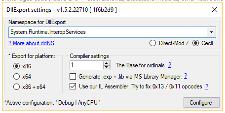

# BeckyPlugin.Net
.NET Plugin SDK for Becky! 2.

# What does it do?
The SDK provides all callbacks (but those for the icons as discussed later) into the generated DLL, abstracting most of the low-level stuff.
It is calling the plugin methods in your own BeckyPlugin.cs through the interface IBeckyPlugin.

Additionally, it provides you with all the DllImport/PInvoke of the Becky! 2 API in B2.EXE. You have got a nice .NET API using C# delegates, the C# Garbage Collector while reducing the handling with pointers.

It gives you the opportunity of referencing arbitrary libraries as it provides you with an assembly loader able to gather the referenced .NET assemblies out of becky/plugins/(assemblyname).

# Existing plugins
 * [AutoAddressBook](plugins/AutoAddressBook)

# How/Where to intall the DLLs to?
The exporting DLL, e.g. "example.dll", including its example.pdb and example.dll.config are to be stored inside the plugin folder of Becky!, which has two locations: in the application and the data folder.

All other DLLs, like BeckyApi.dll, should be located into the sub folder named after the dll, e.g. "plugin/example/BeckyApi.dll" etc

# How to create a new Plugin
0. Create and configure a nlog.config in directory of B2.exe (if not yet existing).

1. Add a new plugin assembly project into /plugins folder having the same output assembly name as its folder name. (Sample: plugins/AutoAddressBook with AutoAddressBook.dll)

  a) This assembly will be used for DllExport'ing the method stubs to Becky.

  b) Provide your own plugin information in /Properties/AssemblyInfo.cs.
    
	Here, the AssemblyTitle is mapped onto the plugin name and the AssemblyCompany is the "vendor" of the plugin.
    AssemblyDescription and AssemblyVersion are mapped as well.

	This is true only if you did not provide plugininfo yourself

  c) The plugin assembly name should not be a prefix of some other plugin if you like the automatisms of copy-and-start.ps1.

2. Add a new plugin implementation assembly project into /pluginimpl folder. (Sample pluginimpl/AutoAddressBookImpl)

This assembly will be used for debugging information as those are lost while modifying the stub.

3. Install Nuget Packages (DllExports, NLog, ModuleInit.Fody) into plugin stub project.

DllExports need to be set to x86 and "System.Runtime.Interop". If you have got problems, uninstall and restart Visual Studio.


4. Add BeckyTypes, BeckyApi as project references. Do **not** add "BeckyPlugin" or any other plugin.
   Reference your new implementation project.

5. Add System.Windows.Forms as assembly reference in both.

6. Change processor architecture to x86 (aka 32 bit) in plugin stub.

7. Copy over ModuleInitializer and BeckyApiEventListener to plugin stub. Copy over BeckyPlugin.cs into implementation project.

Change the namespace inside BeckyApiEventListener and BeckyPlugin accordingly.

8. Alter BeckyPlugin.cs as your business logic impedes.

Use _callsIntoBecky as an object for API calls into Becky!.

9. If neccessary, add the icon exports into BeckyApiEventListener and find out, how to use it. If so, please create a pull request for your bugfixes. :-)

10. modify and start copy-and-start.ps1; it will automatically deploy all plugins into becky and start b2.exe.

11. Create a Readme.md, put it on GitHub and send me a nice postcard. :-)


# How to debug my plugin?

If you've followed my advice of dividing your plugin into a stub and an implementation project, 
you can simply attach to the Becky! process (B2.EXE).

This is quite powerfull.

If you set BeckyStartDebug as the startup-application, put the right Becky! path and reference your plugin, you can simply start/debug it! :-)

Although, there is a PDB file for the plugin stub project, it does not match the DLL as both Fody and DllExport are messing the IL a bit.
Probably the Fody.ModuleInit creates a new, unknown method which alters some hash or such.


# Open ToDos
 * Perhaps creating a Nuget-Package of this SDK, so that each plugin may get the templates via t1?
 * Test all the methods and their mappings/marshalling. (around 40% done)
 * Create a NugetPackage Win32MenuWrapper and include all the correct APIs into PInvoke.
 * Ask Carty to
   * implement some meaning to say "I do NOT implement BKC_OnRequestResource" while exporting, as well as BKC_OnRequestResource2
     i.e. int BKC_OnIgnoreResources() if implemented and return 1 => the resource gathering ignores this dll.
 * Try to put DllExport into Fody and/or Roslyn (https://github.com/dotnet/roslyn/issues/1013)

# How to log and gather logs
Nlog.config still needs to be placed in b2.exe folder. Within nlog.config you can use chainsaw-output into UDP.
Personally, I use [Loginator](https://github.com/dabeku/Loginator) for this purpose.

# How to open a WPF control in a modal window (e.g. plugin configuration)

```C#

var control = new TestUserControl(ConfigurationProperty);
Window window = new Window() {
    Title = "Test",
    Content = control,
    SizeToContent = SizeToContent.WidthAndHeight,
    ResizeMode = ResizeMode.NoResize
};
WindowInteropHelper wih = new WindowInteropHelper(window);
wih.Owner = hWnd;
if (true == window.ShowDialog()) {
    //ConfigurationProperty = form.ChosenConfiguration;
}

```

# Build Tools
 * Visual Studio 2015 (having Resharper).
 * Nuget Package Manager
   * NLog
   * UnmanagedExports (RGiesecke.DllExport (could be a mess with Fody)) or DllExport (GitHub)
   * ModuleInit.Fody
   * PInvoke.User32

# The structure of the solution?

  * BeckyTypes consists of types used for BeckyAPI and the plugin exporters
  * BeckyPluginTemplate is a template to copy files from and for the time being to test the API manually.
  * BeckyApi is the callable API of B2.EXE and, as long as neccessary, file API for the AddressBook.
  * Utilities for classes usable in many plugins (like IniFile)
  * BeckyStartDebug is compiling and copiing the (referenced) plugins (via built event and the ps1 script) and starting up B2.EXE attached to VS.
  * AutoAddressBook is my first 'real' plugin, still in raw shape :)
  * AutoAddressBookImpl is the debuggable implementation of my first plugin.


# License
This SDK is postcardware. Please send a real postcard to me (HeikoStudt). :-)

It would be very nice to open source your plugins as they might be swallowed by time otherwise.


# Acknowledges
Becky! 2 is a software by [Rimarts, Inc.](http://rimarts.co.jp)

This C# .NET SDK is a transcription of the official SDK (originally using version 2.64.0).

The exported methods are using [RGiesecke.DllExport](https://sites.google.com/site/robertgiesecke/Home/uploads/unmanagedexports) via its [Nuget package](https://www.nuget.org/packages/UnmanagedExports/1.2.2.23707).

Another possibility is a fork of above [DllExport](https://github.com/3F/DllExport) which is quite harder (but more advanced).

The module initializing is done via [ModuleInit.Fody](https://www.nuget.org/packages/ModuleInit.Fody/).

The ini-file handling is done via [ini-parser](https://github.com/rickyah/ini-parser).

For putting up some window and menu stuff, you can use the [Nuget Package of PInvoke](https://github.com/AArnott/pinvoke). While most of Win32 APIs are still missing in the package, you can add those [Win32 APIs](http://www.pinvoke.net) yourself.
